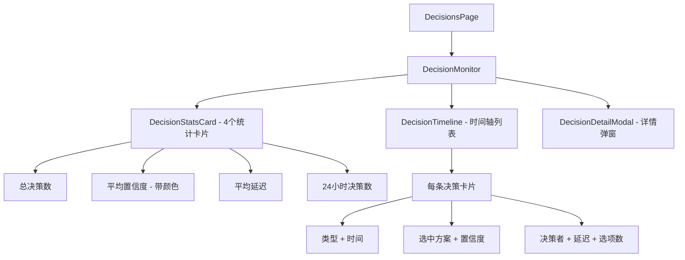
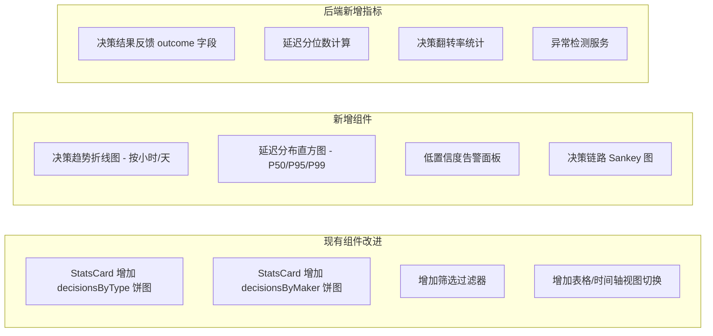

# 决策监控指标分析报告

## 一、当前已有指标清单

通过分析 [`DecisionStats`](frontend/src/types/decision.ts:28) 接口和 [`getDecisionStats()`](backend/src/services/decision.ts:228) 后端服务，当前系统共有 **6 个统计指标**：

| # | 指标名称 | 字段 | 数据来源 | 展示位置 |
|---|---------|------|---------|---------|
| 1 | 总决策数 | `totalDecisions` | `COUNT(*)` | StatsCard 卡片 |
| 2 | 平均置信度 | `avgConfidence` | `AVG(confidence)` | StatsCard 卡片（带颜色等级） |
| 3 | 平均延迟 | `avgLatencyMs` | `AVG(latency_ms)` | StatsCard 卡片 |
| 4 | 24小时决策数 | `recentDecisions` | `COUNT(*) WHERE created_at > -24h` | StatsCard 卡片 |
| 5 | 按类型分布 | `decisionsByType` | `GROUP BY decision_type` | 仅后端返回，**前端未展示** |
| 6 | 按决策者分布 | `decisionsByMaker` | `GROUP BY decision_maker` | 仅后端返回，**前端未展示** |

### 每条决策记录的字段（时间轴展示）

在 [`DecisionTimeline`](frontend/src/components/decisions/DecisionTimeline.tsx:12) 中，每条决策显示：

- **决策类型** (`decision_type`) — 如 model_selection、tool_choice
- **选中方案** (`selected_option`) — 最终选择的选项
- **置信度** (`confidence`) — 以百分比 + 颜色标签展示
- **决策者** (`decision_maker`) — 规则/LLM/人工/混合（图标 + 文字）
- **决策延迟** (`latency_ms`) — 毫秒/秒
- **备选方案数** (`options.length`)
- **创建时间** (`created_at`)

### 决策详情弹窗（[`DecisionDetailModal`](frontend/src/components/decisions/DecisionDetailModal.tsx:11)）额外展示：

- 推理过程 (`reasoning`)
- 所有备选方案的评分、优点、缺点
- 决策上下文 JSON (`context`)
- 元数据 JSON (`metadata`)

---

## 二、对开发人员的实用性评估

### ✅ 有用的指标

| 指标 | 实用性 | 开发者场景 |
|------|--------|-----------|
| **平均置信度** | ⭐⭐⭐⭐⭐ | 快速判断 Agent 决策质量是否整体偏低，发现模型退化 |
| **平均延迟** | ⭐⭐⭐⭐⭐ | 发现性能瓶颈，优化决策链路的关键依据 |
| **决策类型分布** | ⭐⭐⭐⭐ | 了解 Agent 最常做什么决策，聚焦优化重点 |
| **决策者分布** | ⭐⭐⭐⭐ | 评估自动化程度——人工干预过多说明规则/LLM 不够可靠 |
| **推理过程** | ⭐⭐⭐⭐⭐ | 调试 Agent 行为最核心的信息，理解"为什么这么选" |
| **备选方案对比** | ⭐⭐⭐⭐ | 分析 Agent 是否考虑了足够的选项、评分是否合理 |

### ⚠️ 有用但展示不足的指标

| 指标 | 问题 |
|------|------|
| **按类型分布** `decisionsByType` | 后端已计算，但前端 [`DecisionStatsCard`](frontend/src/components/decisions/DecisionStatsCard.tsx:10) **没有展示**，浪费了 |
| **按决策者分布** `decisionsByMaker` | 同上，后端有数据但前端未渲染图表 |
| **总决策数** | 单独看意义有限，需要结合趋势才有价值 |
| **24小时决策数** | 只是一个快照数字，缺少趋势对比（同比/环比） |

---

## 三、缺失的重要指标（建议新增）

### 🔴 高优先级

| 指标 | 说明 | 开发者价值 |
|------|------|-----------|
| **决策成功率/结果反馈** | 决策执行后是否成功（需要 `outcome` 字段） | 最关键！当前只记录了决策过程，但不知道决策结果是否正确 |
| **低置信度决策告警** | confidence < 阈值的决策计数和列表 | 快速定位需要人工审查的高风险决策 |
| **决策延迟 P50/P95/P99 分位数** | 当前只有 AVG，掩盖了长尾问题 | 发现极端延迟场景，AVG 无法反映真实性能 |
| **决策漏斗/链路追踪** | 一个 session 内的决策链条关系 | 理解 Agent 的多步决策流程和依赖关系 |
| **决策趋势图** | 按小时/天的决策数量、置信度、延迟趋势 | 发现性能退化、异常波动 |

### 🟡 中优先级

| 指标 | 说明 | 开发者价值 |
|------|------|-----------|
| **决策翻转率** | 同类型决策在短期内选择不同方案的频率 | 发现 Agent 决策不稳定的问题 |
| **选项集中度** | 某个选项被选中的比例（如 gpt-4 被选了 90%） | 发现决策是否过于单一，是否真正在"决策" |
| **决策耗时分布直方图** | 按时间段的延迟分布 | 更直观地发现性能异常 |
| **按 session 聚合** | 每个 session 内的决策数量、平均置信度 | 对比不同会话的决策质量 |
| **决策异常检测** | 置信度突然下降、延迟突然增加的自动告警 | 主动发现问题而非被动排查 |

### 🟢 低优先级

| 指标 | 说明 |
|------|------|
| 决策上下文相似度 | 相似上下文下的决策一致性 |
| 人工覆盖率 | 人工修改 Agent 决策的比例 |
| 决策成本关联 | 每个决策关联的 token/API 成本 |

---

## 四、当前图形展示评估

### 当前展示架构

### ✅ 展示做得好的方面

1. **统计卡片** — 4 个关键数字一目了然，设计简洁
2. **置信度颜色分级** — excellent/good/fair/poor 四级颜色直观
3. **时间轴布局** — 按时间顺序展示决策流，符合因果逻辑
4. **决策者图标** — 规/模/人/混 汉字图标辨识度高
5. **详情弹窗** — 点击展开完整信息，信息层次分明

### ❌ 展示不足的方面

| 问题 | 具体描述 | 建议 |
|------|---------|------|
| **缺少图表** | 只有纯数字和列表，没有任何可视化图表 | 加入饼图展示类型/决策者分布、折线图展示趋势 |
| **数据浪费** | `decisionsByType` 和 `decisionsByMaker` 后端已返回但未展示 | 在 StatsCard 下方增加分布图 |
| **无趋势感** | 只有当前快照数值，看不出变化方向 | 增加时间趋势折线图 |
| **无筛选过滤** | 无法按决策类型、置信度范围、时间段筛选 | 增加过滤器栏 |
| **信息密度低** | 时间轴列表每条决策占空间大，大量决策时需要滚动 | 可增加表格视图切换 |
| **无对比功能** | 无法对比不同时间段、不同 session 的决策 | 增加多维对比视图 |

---

## 五、改进建议总览

### 优先级排序

1. **展示已有但未渲染的数据** — 类型分布饼图、决策者分布饼图（改动最小，价值即现）
2. **增加趋势图** — 按时间的决策量、置信度、延迟折线图
3. **增加延迟分位数** — P50/P95/P99 替代纯 AVG
4. **增加筛选过滤** — 按类型、决策者、置信度范围、时间段
5. **增加决策结果反馈** — 需要新增 outcome 字段和 API
6. **增加异常告警** — 低置信度、高延迟的自动告警
